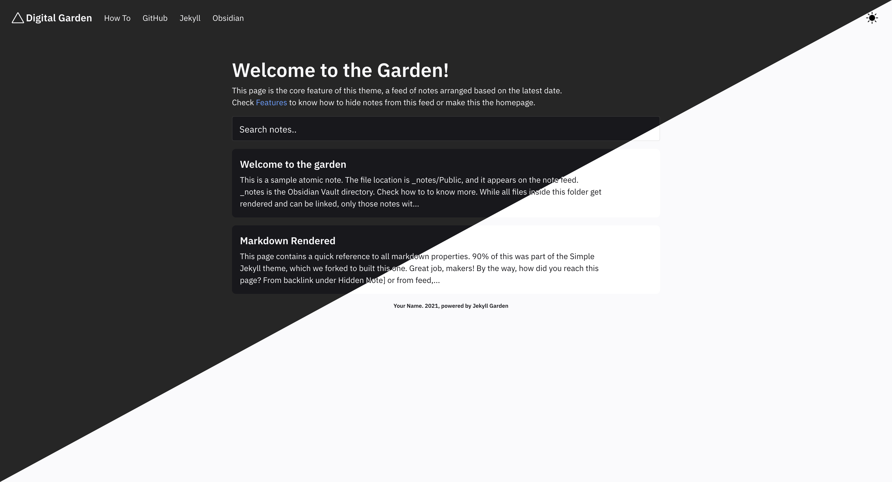

# Jekyll Garden v 0.3 (Stable)

This is a simple Jekyll theme created for building a digital garden with Obsidian and Github Pages. You have to fork this theme to your Github account, configure Github pages, and start using the `_notes` folder as the Obsidian vault. Check out [the demo](https://jekyll-garden.github.io/). 

## Installation (Github pages)
_Detailed Installation how-to, with screenshots available [here](https://jekyll-garden.github.io/posts/how-to)_

